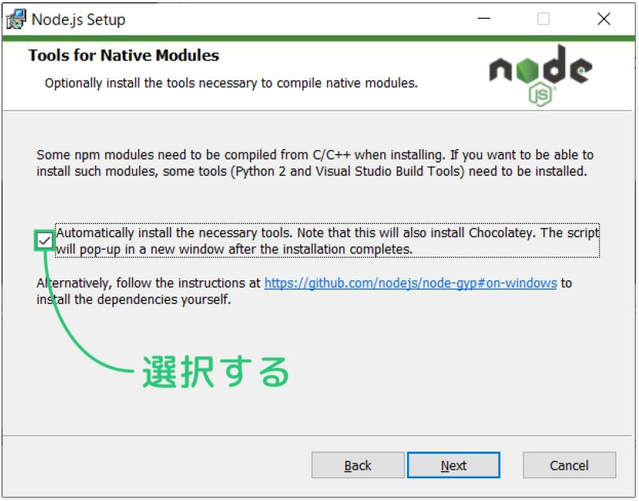
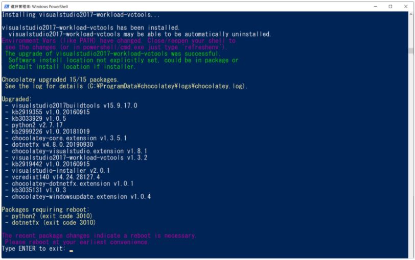

# Process to use Cypress
## Download and Install node.js
### Select checkbox.



### Wait until Confirm if "Type Enter to exit" is displayed in the Powershell prompt.



### Finish. No need to reboot windows.

## Confirm if node and npm are installed correctly

### node version

```dosbatch
node -v
```

### npm version

```dosbatch
npm -v
```

## Install Cypress

```dosbatch
npm install cypress --save
```

## Confirm the operation

```dosbatch
# verify cypress
npx cypress verify

# execute cypress
npx cypress open
```

## Where is integration folder

There is in the directory you execute `npx cypress open`.

## Process to avoid CORS mechanism

Edit `cypress.json` to avoid 'Cypress Error' by CORS mechanism.

### Where is `cypress.json`

There is in the directory you execute `npx cypress open`.

### How to edit

<p>
  Add this key-value. (You can watch detail <a href="https://docs.cypress.io/guides/guides/web-security#Set-chromeWebSecurity-to-false" target="_blank">Here</a>)
</p>

```json
{
  "chromeWebSecurity": false
}
```

## Usage for Cypress

- https://qiita.com/kkakizaki/items/4b6625a56fd2fa4c741c
- https://qiita.com/eyuta/items/a2454719c2d82c8bacd5
- https://future-architect.github.io/articles/20210428a/
- https://qiita.com/oh_rusty_nail/items/58dcec335d67e81816dd

