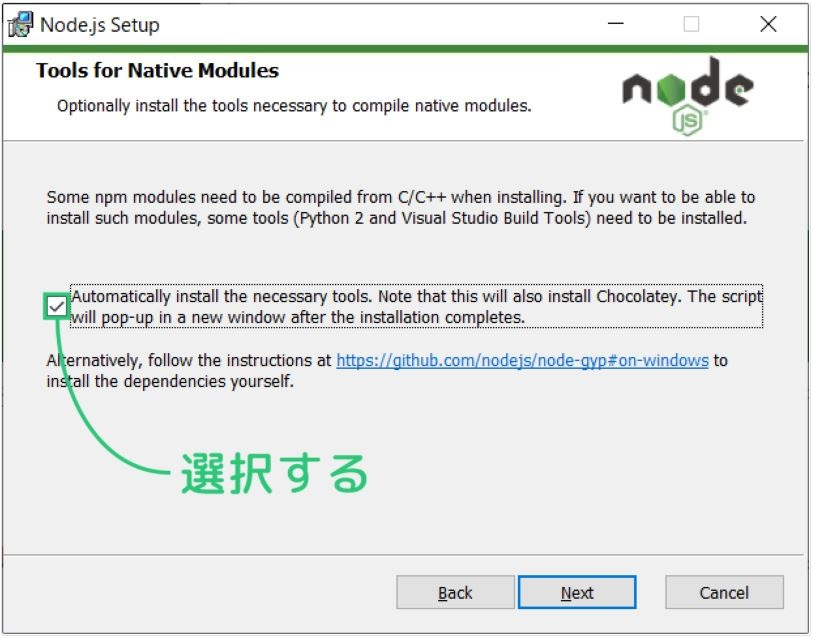
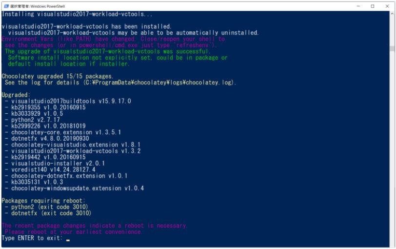

# Process to use Selenium
## Download and Install node.js
### Select checkbox.



### Wait until Confirm if "Type Enter to exit" is displayed in the Powershell prompt.



### Finish.

No need to reboot windows.

## Check whether node and npm are installed correctly or not.

### node version

```dosbatch
node -v
```

### npm version

```dosbatch
npm -v
```

## Install tools

### Install Package
```dosbatch
npm install selenium-webdriver --save
npm install mocha --save
:: not able to use selenium this following statement about install in windows (Maybe PATH is needed) .
:: npm install -D selenium-webdriver mocha chromedriver@96.0.0
```

### Download and put into current folder
- Download `.exe` file in [this site](https://sites.google.com/chromium.org/driver/downloads).
- Then put `chromedriver.exe` into current folder.

### Directory structure to execute (Minimal Configuration)

```dosbatch
EXECUTION DIRECTORY
│  chromedriver.exe
│  index.js
│  package.json
```

## Test

```dosbatch
npx mocha index.js --timeout 0
```

## Coding
### Reference
The part of Java in [this site](https://www.seleniumqref.com/index.html) is good to refer as javascript.


## About Package.json
`Package.json`にスクリプトを登録すると、実行コマンドを短くできます。
例えば、以下のように登録すると、

```json
{
    "scripts": {
        "psl": "npx mocha kouhochi-ichiran.js --timeout 0"
    }
}
```

以下のコマンドで実行できる。

```shell
npm run psl
```

