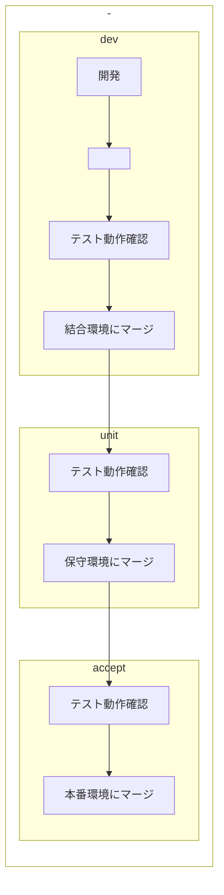
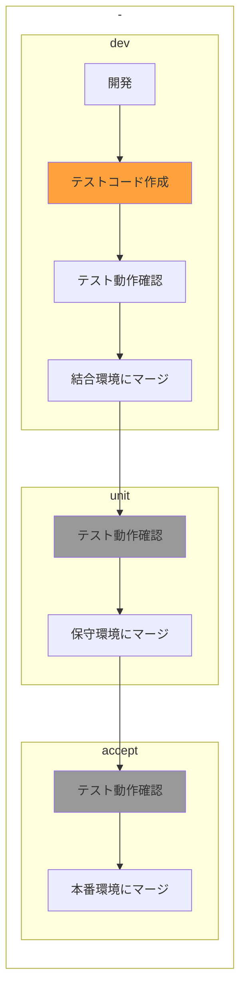

# Effect Explanation

ツールの導入前

```mermaid
graph LR;
    subgraph all[-]
        subgraph accept
            acceptA-->acceptB[本番環境にマージ];
        end
        subgraph unit
            unitA-->unitB[保守環境にマージ];
            unitB-->acceptA[テスト動作確認];
        end
        subgraph dev
            devA[開発]-->devB[ ];
            devB-->devC[テスト動作確認];
            devC-->devD[結合環境にマージ];
            devD-->unitA[テスト動作確認];
        end
    end
    style all fill:#ffffff
```

ツールの導入後

```mermaid
graph LR;
    subgraph all[-]
        subgraph accept
            acceptA-->acceptB[本番環境にマージ];
        end
        subgraph unit
            unitA-->unitB[保守環境にマージ];
            unitB-->acceptA[テスト動作確認];
        end
        subgraph dev
            devA[開発]-->devB[テストコード作成];
            devB-->devC[テスト動作確認];
            devC-->devD[結合環境にマージ];
            devD-->unitA[テスト動作確認];
        end
    end
    style all fill:#ffffff
    style devB fill:#ffa23e
    style unitA fill:#999999
    style acceptA fill:#999999
```

